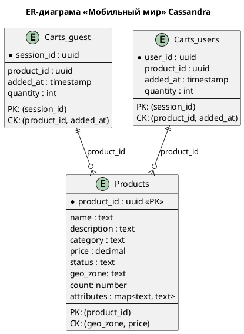

### **Название задачи: Миграция на Cassandra**
### **Автор: Кушу Л.Р.**
### **Дата:23.05.2026**
### **Проблематика**
Во время «чёрной пятницы» интернет-магазин использовал MongoDB с шардированием на основе диапазонов (Range-Based Sharding). При резком увеличении нагрузки (50 000 запросов/сек.) возникла высокая задержка при масштабировании:

При добавлении новых шардов MongoDB полностью перераспределяла данные между всеми узлами, что вызывало просадку latency в пик нагрузки, так как система тратила ресурсы на перемещение данных.

Руководство решило перейти на БД Cassandra, чтобы обеспечить:
- Высокую отказоустойчивость (leaderless‑репликация).
- Быстрое горизонтальное масштабирование без полного перераспределения данных.
- Равномерное распределение данных.

### **Решение**

1. Определение критически важных данных интернет-магазина  
Критически важными для интернет-магазина являются Товары (products), Корзины (carts), Заказы (orders). Так как все эти данные 
используются для покупок и соответсвенно приносят прибыль интернет-магазину.  
Наиболее высоконагруженными являются товары и корзины, для них применение Cassandra имеет смысл. Заказы будут менее нагружены и их
перенос в cassandra не столь критичен. 

2. Модель для выбранных данных

Для Products partition key выбран product_id, что поможет равномерно распределить продукты по шардам и минимизарует шансы
появления горячих шардов, а clustering key выбраны geo_zone и price так как по этим полям часто будет применяться фильтрация.

Carts были разбиты на две таблицы, Carts_guest и Carts_users так как partition_key будет отличаться у Carts_guest это будет
session_id, а Carts_users user_id, в качестве clustring key выбраны product_id и added_at, т.к. по ним ожидается фильтрация

3. Какие стратегии можно применить для обеспечения целостности данных

Для таблиц Carts и Products нужно применять стратегию Read Repair с высоким уровнем согласованности, так как это у нас 
будут часто читаемые данные на основе которых будут формироваться заказы, в данном случае прийдется пожертвовать latency
или подумать над способом кеширования данных.
