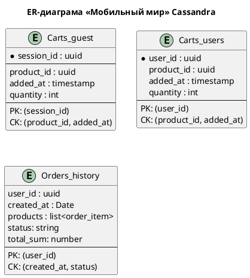

### **Название задачи: Миграция на Cassandra**
### **Автор: Кушу Л.Р.**
### **Дата:23.05.2026**
### **Проблематика**
Во время «чёрной пятницы» интернет-магазин использовал MongoDB с шардированием на основе диапазонов (Range-Based Sharding). При резком увеличении нагрузки (50 000 запросов/сек.) возникла высокая задержка при масштабировании:

При добавлении новых шардов MongoDB полностью перераспределяла данные между всеми узлами, что вызывало просадку latency в пик нагрузки, так как система тратила ресурсы на перемещение данных.

Руководство решило перейти на БД Cassandra, чтобы обеспечить:
- Высокую отказоустойчивость (leaderless‑репликация).
- Быстрое горизонтальное масштабирование без полного перераспределения данных.
- Равномерное распределение данных.

### **Решение**

1. Определение критически важных данных интернет-магазина  
Продукты и заказы выносить нельзя, так как при создании заказа используется транзакционная логика.

Можно вынести корзины, так как это высоконогруженные временные данные не требующие транзакций с другими сущностями. 
И так же можно вынести истории заказов, так как эти данные пишутся один раз и в последуюшем не меняются

2. Модель для выбранных данных

Carts были разбиты на две таблицы, Carts_guest и Carts_users так как partition_key будет отличаться у Carts_guest это будет
session_id, а Carts_users user_id, в качестве clustring key выбраны product_id и added_at, т.к. по ним ожидается фильтрация

3. Какие стратегии можно применить для обеспечения целостности данных

Для таблиц Carts нужно применить стратегию Read Repair с высоким уровнем согласованности, так как пользователю надо показывать
актуальное состояние корзины, иначе есть шанс испортить пользовательский опыт.

Для таблицы Orders_history можно так же применить Read Repair но с менее высоким уровнем согласованности, так как эти данные
не несут критики.
