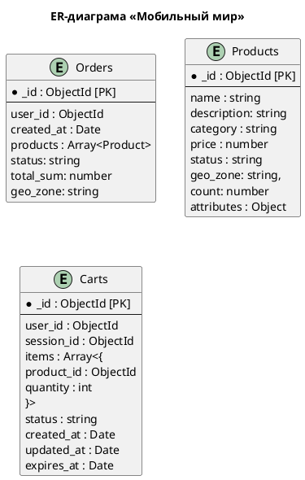

### **Название задачи: Проектирование схем коллекций для шардирования данных** 
### **Автор: Кушу Л.Р.**
### **Дата: 17.05.2026**
### **Функциональные требования**

| **№** | **Действующие лица или системы**           | **Use Case**                               | **Описание**                                                                                                                                                        |
|:-----:|:-------------------------------------------|:-------------------------------------------|:--------------------------------------------------------------------------------------------------------------------------------------------------------------------|
|  UC1  | Пользовтель, микросервис заказов           | Создание заказа                            | Быстрое создание заказов с одновременным списанием остатков                                                                                                         |
|  UC2  | Пользовтель, микросервис заказов           | Поиск заказа                               | Поиск истории заказов конкретного пользователя                                                                                                                      |
|  UC3  | Пользовтель, микросервис заказов           | Статус заказа                              | Отображение статуса заказа                                                                                                                                          |
|  UC4  | Микросервис заказов, Микросервис продуктов | Обновление остатков                        | Обновления остатков при покупках                                                                                                                                    |
|  UC5  | Пользователь, Микросервис продуктов        | Поиск товаров                              | Поиск товаров по категориям и фильтрация по диапазону цен                                                                                                           |
|  UC6  | Пользователь, Микросервис продуктов        | Описание товара                            | Описание товара на странице продукта.                                                                                                                               |
|  UC7  | Пользователь, Микросервис корзин           | Создание корзины                           | Создание корзины, когда заходит гость или новый пользователь. Получение текущей корзины по фильтру { session_id, status:"active" } или { user_id, status:"active" } |
|  UC8  | Пользователь, Микросервис корзин           | Редактирование товаров в корзине           | Добавление или замена товара в корзине                                                                                                                              |
|  UC9  | Пользователь, Микросервис корзин           | Удаление товара из корзины                 | Удаление товара из корзины                                                                                                                                          |
| UC10  | Пользователь, Микросервис корзин           | Слияние гостевой и пользовательской корзин | Слияние гостевой корзины в пользовательскую, если пользователь залогинится                                                                                          |
| UC11  | Пользователь, Микросервис корзин           | Изменение статуса корзины                  | Отметка корзины как заказанной                                                                                                                                      |

### **Нефункциональные требования**
Опишите здесь нефункциональные требования и архитектурно значимые требования.

| **№** | **Требование**                                                           |
|:-----:|:-------------------------------------------------------------------------|
|   P   | Производительность (Performance)                                         |
|  P1   | Обеспечить быструю скорость выполнения всех типов операций с коллекциями |

### **Схемы данных коллекций**

### **Решение**

- Для коллекции **Orders** будет использоваться стратегия хешированнаое шардирование с ключом user_id, так заказы одного пользователя попадут
на одну шарду, что упростит выборку по конкретному пользователю.

- Для коллекции **Products** будет использоваться стратегия гео + диапозонное шардирование  ключ будет состоять из трех полей
гео-зона, категория и цены. Это ускорит фильтрацию продуктов и обновление остатков

- Для коллекции **Carts** было принято решение использовать динамической шардирование, в силу отсутствие единого поля для шардирования 
(user_id или session_id). Поисковый сервис будет хранить маппинг обоих ключей на шард, обеспечивая точечную маршрутизацию и слияние корзин.